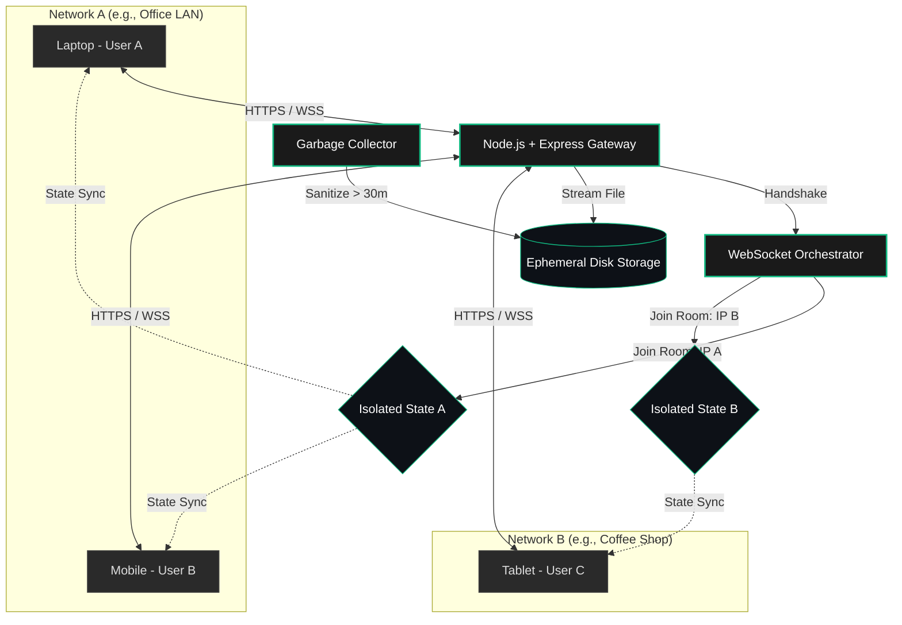

<div align="center">

<!-- Animated Header -->
<picture>
  <source media="(prefers-color-scheme: dark)" srcset="https://readme-typing-svg.herokuapp.com?font=Fira+Code&weight=500&size=35&duration=4000&pause=1000&color=10B981&center=true&vCenter=true&width=800&lines=LocalShare+Pipeline;Zero-Config+LAN+File+Transfer;Real-time+WebSocket+Synchronization;Secure.+Ephemeral.+Blazing+Fast.">
  
</picture>

**An enterprise-grade, zero-configuration local file and text sharing orchestration engine.**

[](#)
[](#)
[](#)
[](#)
[](#)

</div>

---

## ⚡ Overview

**LocalShare** is a high-performance, real-time signaling and file-transfer gateway designed to facilitate seamless data exchange across localized network environments. Built with a focus on **ephemeral data management** and **low-latency WebSocket orchestration**, it provides an AirDrop-like experience across any operating system without requiring client-side installations, complex authentication, or external cloud storage.

Designed with a cinematic, glassmorphism-inspired UI and an airtight backend, it demonstrates core principles of modern systems engineering: **state isolation, automated garbage collection, and real-time bidirectional communication.**

## 🚀 Technical Capabilities

*   **🌐 IP-Based Network Multiplexing:** Automatically partitions user sessions into isolated WebSocket rooms based on their public/LAN IPv4 footprint.
*   **⏱️ Real-Time State Synchronization:** Sub-millisecond text and presence synchronization leveraging `Socket.io` event emission.
*   **🗑️ Ephemeral Storage & Garbage Collection:** Implements an automated, non-blocking cron interval that securely sanitizes server disk space by purging orphaned assets every 30 minutes.
*   **🐳 Containerized & Cloud-Agnostic:** Fully Dockerized for horizontal scaling and rapid deployment on platforms like Hugging Face Spaces, Fly.io, or AWS ECS.
*   **🎨 Zero-Dependency UI:** A pristine, vanilla HTML5/CSS3 frontend utilizing CSS Grid and minimal DOM manipulation for maximum render efficiency.

---

## 📐 System Architecture

The following diagram illustrates the event-driven routing and IP-based room isolation that ensures absolute privacy between distinct network environments.



---

## 🛠️ Tech Stack & Engineering Choices

| Component | Technology | Rationale |
| --- | --- | --- |
| **Core Runtime** | `Node.js` | Asynchronous, event-driven architecture ideal for persistent I/O operations. |
| **Transport Layer** | `Socket.io` | Ensures connection resilience with fallback polling and native broadcasting capabilities. |
| **HTTP Routing** | `Express.js` | Lightweight middleware pipeline for efficient static asset serving and RESTful endpoints. |
| **Multipart Parsing** | `Multer` | High-throughput streaming of binary file data directly to the filesystem. |
| **Containerization** | `Docker` | Guarantees environmental parity across development, testing, and production phases. |

---

## 🚦 Getting Started

### Prerequisites

* Node.js (v18.x or higher)
* Docker (Optional, for containerized environments)

### Local Development Startup

1. **Clone the repository:**

```bash
   git clone [https://github.com/SunbalAzizLCWU/lanshare.git](https://github.com/SunbalAzizLCWU/lanshare.git)
   cd localshare

```

2. **Install dependencies:**

```bash
   npm install

```

3. **Initialize the server:**

```bash
   npm start

```

*The orchestration engine will initialize on `http://localhost:3000` and automatically bind to your machine's local IPv4 address.*

### Enterprise Deployment (Docker)

To deploy the service in an isolated container:

```bash
# Build the image
docker build -t sunbalazizlcwu/localshare:latest .

# Run the container mapping port 3000
docker run -d -p 3000:3000 --name localshare-node sunbalazizlcwu/localshare:latest

```

---

## 👨‍💻 Engineering Lead

**Sunbal Aziz**

*AI & ML Engineer | Full-Stack Developer*

Architecting robust, intelligent pipelines and highly scalable web infrastructure.

* **GitHub:** [@SunbalAzizLCWU](https://github.com/SunbalAzizLCWU)
* **Status:** Open to B2B Consulting & Engineering Roles
